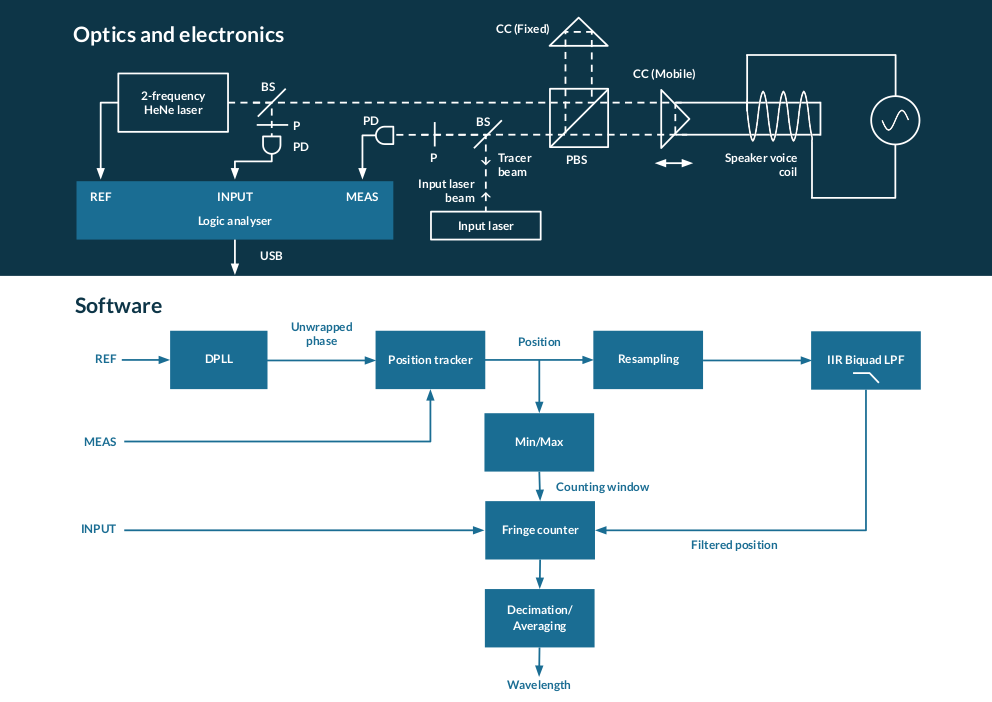

The Noptica Wavemeter
=====================

An open source laser wavemeter with NO expensive optics and NO machining.

Overview
--------

Traveling Michelson wavemeters are one of the simplest designs that one can build. However, a high-resolution wavemeter requires the travel of a cube corner over a long range of motion. This motion needs to be smooth and vibration-free, which makes the mechanical design and construction rather difficult, and maintaining alignment over the whole range of travel is also challenging.

This design avoids those difficulties by restricting the range of motion to about a millimeter, which allows a low-cost voice coil to be used as actuator, such as an actual audio speaker with the corner cube glued in the middle. As a result, this wavemeter can be built entirely using low-cost off-the-shelf components.

While this reduced range of motion corresponds to a similar reduction in resolution in a traditional Michelson wavemeter, this design compensates by using the following techniques:

1. The position of the fringes of the unknown laser is measured precisely by using a two-frequency HeNe laser as the reference, in a displacement measurement interferometer (DMI) configuration.
2. A DMI only reports the position of the moving cube corner at the MEAS edges, and those edges may not coincide with the fringes of the input laser. In this design, the position is then extrapolated using a low-pass IIR filter. The filter also attenuates other sources of noise, such as quantization noise.
3. The scanning rate (around 50Hz) is higher than that of regular Michelson wavemeters, and many output measurements are averaged.

Recommended reading
-------------------

We assume that the reader has a basic understanding of the principles of displacement measurement interferometers using two-frequency lasers, and of traveling Michelson wavemeters. The links below provide a good introduction to them.

* http://www.repairfaq.org/sam/laserlia.htm#liaint2fl
* https://www.ph.unimelb.edu.au/~scholten/atomopt/publications/wavemeter_amjphys_vol67_p624_1999.pdf

Detailed description
--------------------

The core of the design is a displacement measurement interferometer with a corner cube moving back and forth, and the input laser superimposed on the DMI beam but propagating in the opposite direction. The input laser traverses the same optical path as the DMI beam, interferes with itself, and produces a bright or dark spot at the photodetector depending on the optical path difference between the two arms of the interferometer. Meanwhile, the DMI constantly measures this optical path difference, which it can do precisely as its beam is superimposed with the input beam. The distance, as measured by the DMI, between bright and dark spots (fringes) corresponds to the wavelength of the input laser.

To improve precision, a distance measurement is taken for several thousands of consecutive input laser fringes, for about one half-cycle ("scan") of the corner cube motion. The distance between the first and last fringe is divided by the number of intervals between fringes that have been counted during the scan.

The DMI beam has the same function as the tracer beam in traditional Michelson interferometers. One disadvantage of this design, however, is that the tracer beam cannot be blocked by a simple polarizer as it has two orthogonally polarized components.

The input laser must be circularly polarized, or polarized 45 degrees from the axes of the DMI's polarizing beam splitter (PBS), so that equal power comes out of each side of the PBS. After the beams are recombined by the PBS, they do not interfere yet as they are orthogonally polarized. A polarizer at 45 degrees in the recombined beam creates the interference.

The mobile corner cube is mounted in the center of an audio speaker. This is easy to do using two-component epoxy glue and a short section of rigid water pipe of a diameter slightly smaller than the corner cube. This arrangement has a mechanical resonance, at a frequency around 47Hz on the prototype, at which little drive power is required to obtain an oscillation amplitude of over a millimeter. At resonance, the speaker can be connected directly to a typical function generator without an additional amplifier, and sufficient displacement can still be obtained.

All the signals coming from the optical setup (REF from the two-frequency laser, MEAS from the DMI photodetector, and INPUT from the input laser photodetector) are sampled by a logic analyzer that streams the raw data into a computer for analysis in software.

The software's main loop runs at each cycle of the 48MHz sample clock of the logic analyzer.

A digital phase locked loop (DPLL) locks to the REF signal (around 2MHz) and provides phase information at each cycle of the sample clock (48MHz). It also "unwraps" the phase: a second phase accumulator inside the DPLL does not wrap around at each cycle of the REF clock, but after a large number of cycles. This "unwrapped" phase output makes the job of the position tracker easier. The position tracker monitors the MEAS signal for edges, and uses the unwrapped phase difference between consecutive MEAS edges to deduce the displacement.

Those two components, the DPLL and the position tracker, are enough to form a basic DMI setup. The program ``simple-dmi`` does that, and adds decimation/averaging to the output. It can be used as a minimalist alternative to Sam Goldwasser's µMD1 that runs on Linux (and uses a Glasgow logic analyzer instead of the chipKit DP32). The output can be plotted in real time with PyQtGraph using ``plot.py``.

The wavemeter cannot use the raw output of the position tracker for two reasons:

1. The resolution (due to the digital sampling) is only approximately 633nm\*2MHz/48MHz = 26nm.
2. MEAS edges, and therefore position updates, only arrive on average at the REF frequency, around 2MHz. The last update can be as old as roughly 0.5µs. For an optical path displacement of 2mm that is traveled in 10ms, using the last position introduces an error of roughly 2mm/10ms\*0.5µs = 100nm (NB: This is just a ballpark number, the speed varies as the motion of the corner cube is roughly sinusoidal, and the MEAS frequency also varies depending on the speed and direction of motion of the cube).

Those sources of noise are attenuated using a digital filter. First, the position signal (whose rate of updates varies due to REF instability and the Doppler effect on MEAS) is resampled to a constant 48MHz by duplicating samples. This is followed by a biquad IIR low-pass filter.

The rest of the wavemeter algorithm is fairly straightforward. The minimum and maximum positions of the moving corner cube are monitored, and a position window during which fringes are counted is determined. Every time the moving corner cube enters and leaves this window (in both directions of motion), the positions of the first and last fringes from the input laser are stored along with the number of fringes within the window; this information is then used to compute the input laser wavelength. Several measurements are then averaged to further reduce noise and generate the final wavelength output. As the scanning rate is higher than in typical Michelson wavemeters, an update rate better than 1Hz is still feasible with a high averaging/decimation factor.

Shopping list
-------------

* Reference laser: HP 5501B from eBay. Those are exceptionally well-built and documented, making diagnostics and repairs easier. It is also possible to make something similar yourself, see Sam's instructions.
* Photodetectors: HP 10780 from eBay. With the operating parameters of the prototype, the frequency of the input laser fringes is high enough during the useful portion of the corner cube's trajectory that the 10780's cut-off frequency is not an issue. The advantages of those devices are the built-in polarizers, the alignment aids, and the well-designed relatively fast photodiode amplifiers and detectors. In case a 10780A does need modifications, the schematics are here: http://repairfaq.cis.upenn.edu/Misc/Lasers/hp/hp10780.jpg. The mating connector for the round 4-pin connector on the HP 10780 is extremely rare and expensive; one way to deal with them is to replace them with Chinese "XS9-4" connectors.
* Logic analyzer: Glasgow https://github.com/GlasgowEmbedded/Glasgow (Sigrok + fx2lafw was initially attempted, but abandoned due to USB bugs at high sample rates).
* Interface to the logic analyzer: the "line receiver" part of http://www.repairfaq.org/sam/uMD1/uMD1.htm
* Optics and mounts: eBay or http://www.cdhoptics.com/. Do not order the cheapest mount from DHC as it is particularly bad (e.g. bends when the screw into the optical breadboard is tightened, with obvious results on the optical alignment). Instead, ask for the "high stability" one (GCM-5302M), which is barely more expensive but will save you a lot of frustration.

Current status
--------------

* Prototype built, wavelength output (with unstabilized HeNe tube as input) is stable at <2pm level.
* Design may contain errors and things that can be simplified or optimized further. This is a highly experimental system and YMMV.
* HP 5501B lasers do not like light (at any wavelength) sent into their aperture; the stabilization circuit fails and the REF output becomes wrong. Workaround is to misalign the input beam, which obviously introduces cosine error. A better solution is needed, maybe rebuild a 2-frequency HeNe but use the waste beam of the tube for REF/intensity measurements unlike the HP design. The HeNe tube itself attenuates incoming light.

Software
--------

The software in this repository is copyright (C) 2019 Sébastien Bourdeauducq and licensed under the GNU Lesser General Public License as published by the Free Software Foundation, either version 3 of the License, or (at your option) any later version. See the LICENSE file.

Basically, do whatever you want with this program, but keep the core open. I'm fed up with proprietary laser equipment with pricing through the roof, salespeople wearing ties, and hobbyist-hostile policies.

To build, install Rust and Cargo and run ``cargo build --release``. This will produce binaries in the ``target`` directory. Do not forget the ``--release`` flag, as the software without the compiler optimizations is too slow for real-time processing. You will also need to install the Glasgow software (with the provided patch that adds the logic analyzer applet) to run the program.

The ``plot.py`` DMI demo requires Python with PyQtGraph and Quamash.

All of the above has been tested on Linux only, and may or may not work on Windows.

If you are using Nix, running ``nix-shell`` will set up Rust, Cargo, patched Glasgow, and Python for you.
